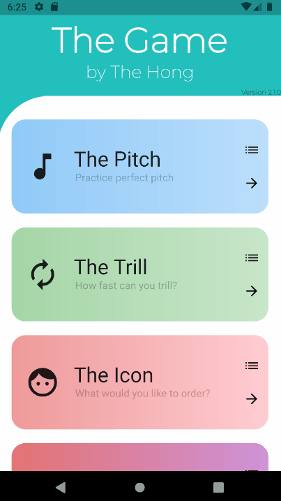

<!--
**TheHong/TheHong** is a ✨ _special_ ✨ repository because its `README.md` (this file) appears on your GitHub profile.

Here are some ideas to get you started:

- 🔭 I’m currently working on ...
- 🌱 I’m currently learning ...
- 👯 I’m looking to collaborate on ...
- 🤔 I’m looking for help with ...
- 💬 Ask me about ...
- 📫 How to reach me: ...
- 😄 Pronouns: ...
- ⚡ Fun fact: ...
-->

<h1> Hello, my name is Chi-Hong!  </h1>

*In this day and age, it's so easy to get caught up in our work and forget that we are still human. So I want to take a moment and ask:*

<h3 align="center">
  How are you doing? 
  How are you feeling today?
</h3>

---

    
  

  

  (Picture credit goes to Abhishek Naidu)

  
 

  

Hello and welcome again! I'm a passionate individual who loves to interact with others, learn new things, and apply technology to address the world's most pressing problems. I've done projects in various fields whether it be a project for a hackathon, a club, research, or just for personal fun!

 

<!--

  
  

-->

<h1> Some of my Favorite Projects on Github</h1>

(The projects on Github are *only a small sample* of the things that I've done. **Impactful solutions require more than just code** 💪. Feel free to reach out to me through LinkedIn or email to learn more!😀)

<h3 align="center">Hover over or click for more information!</h3>

  

  
  

